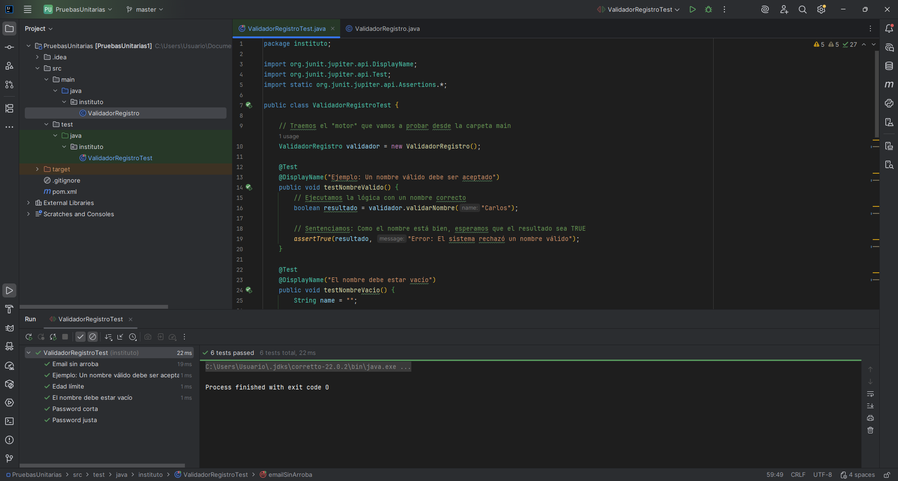

  

# -- Proyecto de Pruebas Unitarias --
Este repositorio contiene una serie de ejercicios y ejemplos prácticos diseñados para aprender y aplicar los conceptos fundamentales de las Pruebas Unitarias (Unit Testing). El objetivo principal es asegurar la calidad del código mediante la validación individual de componentes lógicos.

## 🚀 Contenido del Repositorio
El proyecto está estructurado para cubrir los siguientes aspectos:

1. Lógica de Negocio: Clases base con métodos que realizan operaciones matemáticas, manejo de cadenas o validaciones de datos.

2. Suite de Pruebas: Archivos de prueba que utilizan frameworks como NUnit, xUnit o JUnit.

3. Casos de Prueba:

- Pruebas de "Camino Feliz" (entradas válidas).
- Pruebas de límites (Boundary Testing).
- Manejo de excepciones y errores.

## 🛠️ Tecnologías Utilizadas
- Lenguaje: Java
- Framework de Pruebas: Maven y JUnit
- IDE: IntelliJ

## 📋 Estructura de las Pruebas
En este repositorio se aplica el patrón AAA (Arrange, Act, Assert) para garantizar la claridad de cada test:

- Arrange (Organizar): Se preparan los objetos, variables y el entorno necesario.
- Act (Actuar): Se ejecuta el método o funcionalidad que se desea probar.
- Assert (Afirmar): Se verifica que el resultado obtenido sea igual al resultado esperado.

## 📷 Capturas de las pruebas unitarias

